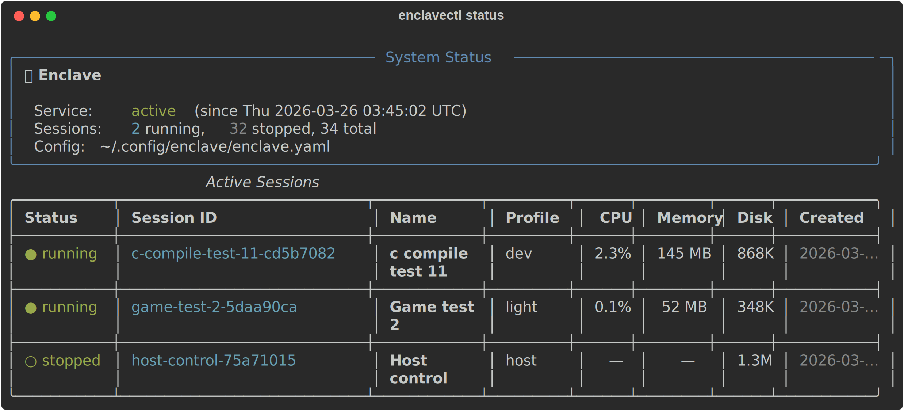
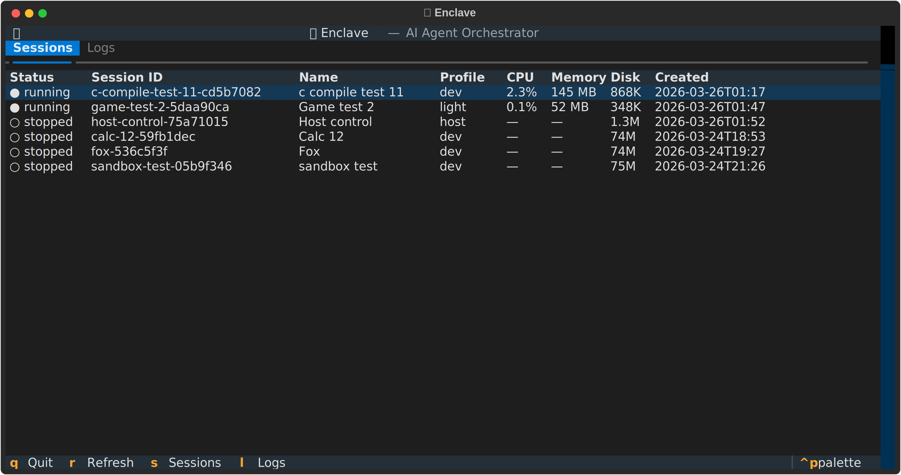

<p align="center">
  
</p>

<h1 align="center">Enclave</h1>

<p align="center">
AI agent instances running on Linux, controlled via Matrix/Element, powered by
the GitHub Copilot SDK. Each agent is sandboxed in a podman container with
explicitly approved permissions.
</p>

## Architecture

```
Element (phone/web)
    │ E2EE
    ▼
Matrix Homeserver (Conduit)
    │ E2EE
    ▼
Orchestrator (host, unprivileged)
    │ Unix sockets
    ├── Agent Pod #1 (podman, sandboxed)
    ├── Agent Pod #2 (podman, sandboxed)
    └── Priv Broker (root, systemd)
```

**Three trust zones:**
- **Orchestrator** — manages Matrix, spawns containers, controls file access
- **Agent containers** — Copilot SDK + custom tools, sandboxed, no host access
- **Privilege broker** — Rust daemon, approval-based root operations via Matrix

See [docs/design.md](docs/design.md) for the full design document.

## Status

🚧 **Active development** — core architecture is functional.
See [docs/ROADMAP.md](docs/ROADMAP.md) for planned features.

## Features

- **Sandboxed agents** — each runs in a podman container with explicit permissions
- **Profile system** — dev (Nix), light (minimal), host (direct) profiles
- **Privilege escalation** — sudo via Matrix approval polls, with pattern-based grants
- **Dynamic mounts** — request host directories at runtime, approved via chat
- **Scheduling** — cron-like recurring callbacks and one-shot timers
- **Session persistence** — conversation history survives container restarts
- **User identity** — agents know your name and pronouns
- **Memory** — persistent cross-session memory with auto-dreaming
- **Sub-agents** — spawn child agents for parallel tasks
- **Display/UI** — launch GUI apps, capture screenshots on Wayland
- **Landlock** — kernel-level filesystem sandboxing
- **Management TUI** — `enclavectl` CLI + interactive terminal dashboard
- **Room cleanup** — clean up Matrix rooms for stopped sessions

### Management CLI

<p align="center">
  
</p>

### Interactive TUI

<p align="center">
  
</p>

## Tech Stack

- **Python 3.12+** — orchestrator + agent
- **github-copilot-sdk** — AI agent runtime
- **matrix-nio[e2ee]** — Matrix E2EE client
- **podman** — rootless container sandboxing
- **Rust** — privilege broker
- **Conduit** — Matrix homeserver
- **systemd** — service management
- **Nix** — reproducible builds and dev environment

## Prerequisites

- **Python 3.12+**
- **Podman** (or Docker)
- **Rust toolchain** (for the privilege broker):
  ```bash
  # If using rustup, ensure a toolchain is installed:
  rustup default stable
  ```
- **Nix** (optional but recommended — `nix develop` provides everything above)

## Installation

```bash
git clone https://github.com/icstatic/enclave.git
cd enclave

# Edit config before starting
cp enclave.yaml.example ~/.config/enclave/enclave.yaml
nano ~/.config/enclave/enclave.yaml

# Install orchestrator (user-level) — builds, installs, and enables the service
./install.sh orchestrator

# Build container image
./install.sh image

# Install privilege broker — builds, installs, and enables the system service
./install.sh broker
```

### NixOS

On NixOS, the privilege broker is managed as a NixOS module. Add the flake
input and enable the service in your `configuration.nix`:

```nix
# flake.nix
{
  inputs.enclave.url = "github:icstatic/enclave";

  outputs = { nixpkgs, enclave, ... }: {
    nixosConfigurations.myhost = nixpkgs.lib.nixosSystem {
      modules = [
        enclave.nixosModules.default
        {
          services.enclave.enable = true;
          services.enclave.broker.allowedUser = "ian";
        }
      ];
    };
  };
}
```

Then rebuild: `sudo nixos-rebuild switch`

The orchestrator is still installed as a user service via `./install.sh orchestrator`.

## Development (Nix)

```bash
# Development shell with all dependencies
nix develop github:icstatic/enclave

# Or clone and develop locally
git clone https://github.com/icstatic/enclave.git
cd enclave
nix develop
pip install --user github-copilot-sdk 'matrix-nio[e2ee]'
python3 -m pytest tests/unit/
```

## License

TBD
